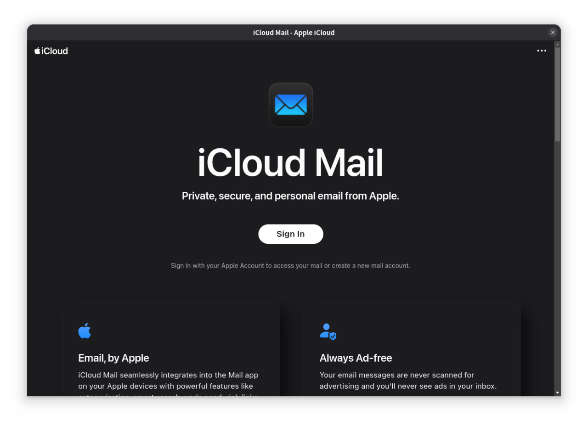

# iCloud Mail

An unofficial desktop application for iCloud Mail built with Electron. This application provides a native desktop experience for accessing Apple's iCloud Mail service on Linux.



## Features

- Native desktop application for iCloud Mail
- Context menu with common actions (Copy, Cut, Paste, Undo, Redo)
- Zoom controls (Zoom In, Zoom Out, Reset)
- External links open in default browser
- Full screen mode support
- Auto-hide menu bar for clean interface
- Desktop notifications support
- Optimized for Linux (X11 and Wayland)

## Installation

### Flatpak (Recommended)

Download the appropriate Flatpak package for your architecture from the [releases page](https://github.com/bdim/icloud-mail/releases):

**For x86_64 systems:**
```bash
flatpak install --user iCloudMail-x86_64.flatpak
```

**For ARM64 systems:**
```bash
flatpak install --user iCloudMail-aarch64.flatpak
```

### Snap

```bash
snap install icloud-mail
```

### Debian Package

Download the `.deb` package from the releases page and install:
```bash
sudo dpkg -i icloud-mail_*.deb
```

## Usage

### Running from Flatpak
```bash
flatpak run moe.bdim.iCloudMail
```

### Running from Snap
```bash
icloud-mail
```

### Running from Source
```bash
npm start
```

## Building from Source

### Prerequisites

- Node.js 20 or higher
- npm
- Electron

### Development Setup

Clone the repository:
```bash
git clone https://github.com/bdim/icloud-mail.git
cd icloud-mail
```

Install dependencies:
```bash
npm install
```

Run the application:
```bash
npm start
```

### Building Packages

**Build Snap and Deb packages:**
```bash
npm run dist
```

**Build Flatpak:**

Generate sources:
```bash
npm run flatpak:generate-sources
```

Build and install Flatpak:
```bash
npm run flatpak:build
```

Run Flatpak:
```bash
npm run flatpak:run
```

## Development

Available npm scripts:

- `npm start` - Run the application in development mode
- `npm run pack` - Package the application without publishing
- `npm run dist` - Build distribution packages (Snap, Deb)
- `npm run flatpak:generate-sources` - Generate Flatpak dependency sources
- `npm run flatpak:build` - Build and install Flatpak package
- `npm run flatpak:run` - Run the installed Flatpak package

## Technical Details

- **Runtime:** Electron 30
- **Base App:** org.electronjs.Electron2.BaseApp
- **Platform:** org.freedesktop.Platform 23.08
- **App ID:** moe.bdim.iCloudMail

## Contributing

Contributions are welcome! Please feel free to submit issues and pull requests.

## License

This project is licensed under the MIT License - see the [LICENSE](LICENSE) file for details.

## Author

- **bdim** - Copyright holder
- **Himel** - Original developer (dev@himelrana.com)
- **Homepage:** https://apps.himelrana.com/icloud-mail

## Disclaimer

This is an unofficial application and is not affiliated with, endorsed by, or associated with Apple Inc. iCloud and iCloud Mail are trademarks of Apple Inc.
